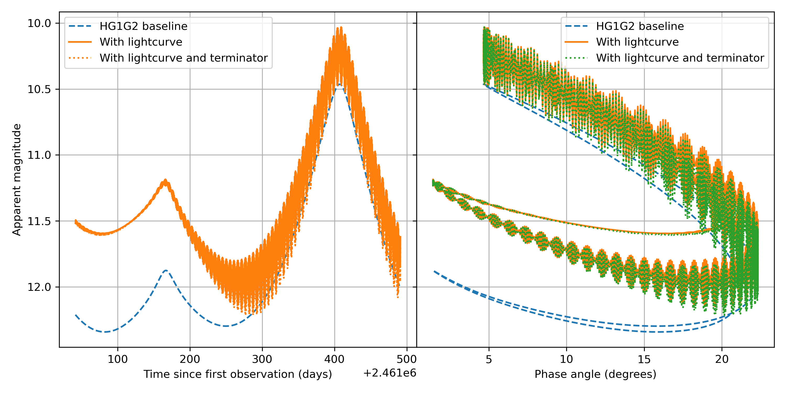

Ellipsoidal with terminator Lightcurve
======================================

Implementation of the light curve generated by spinning ellipsoidal object, accounting
for the non-illuminated part due to changing phase angle.
The apparent reduced magnitude of the object
(that is, the magnitude after the traditionnal geometric effects have been taken into account: distances and phase angle),
has a high frequency term added to it, corresponding to varying projected area of the object on the plane of the sky.
It is based on the [Connelly & Ostro(1984)](https://ui.adsabs.harvard.edu/abs/1984GeDed..17...87C/abstract) model.

To use this function, in the ``Sorcha`` complex parameters file the user must provide:

- ``FieldMJD_TAI``: the time of observation [MJD] in the observer-centric time frame,
- ``Range_LTC_km``: the distance to target at time of observation [km],
- ``RA``: the target right ascension [deg],
- ``Dec``: the target declination [deg],
- ``Period``: : the target sidereal rotation period [days],
- ``Time0``: : the reference time for the rotation [MJD],
- ``phi0``: the longitude of the prime meridian at the reference time [radians],
- ``RA0``: the right ascension of the target's spin axis [radians],
- ``Dec0``: the declination of the target's spin axis [radians],
- ``a/b``: the ratio of targets' equatorial diameters [unitless],
- ``a/c``: the ratio of target's longest equatorial to polar diameters [unitless],
 
For details on the defitions of the rotation parameters (in particular ``Time0`` and ``phi0``),
see 
[Archinal et al. (2018)](https://ui.adsabs.harvard.edu/abs/2018CeMDA.130...22A/abstract)
and/or
[Introduction aux éphémérides et phénomènes astronomiques](https://isbnsearch.org/isbn/9782759824144) (in French).

A simple demonstration :ref:`notebooks` is provided to illustrate
the use of the EllipsoidalLightCurve class built into the
``Sorcha add-ons``package.
To use this prescription, the **lc_model**  variable should be set to **ellipsoidalwithterminator**
in the Sorcha configuration file. 
